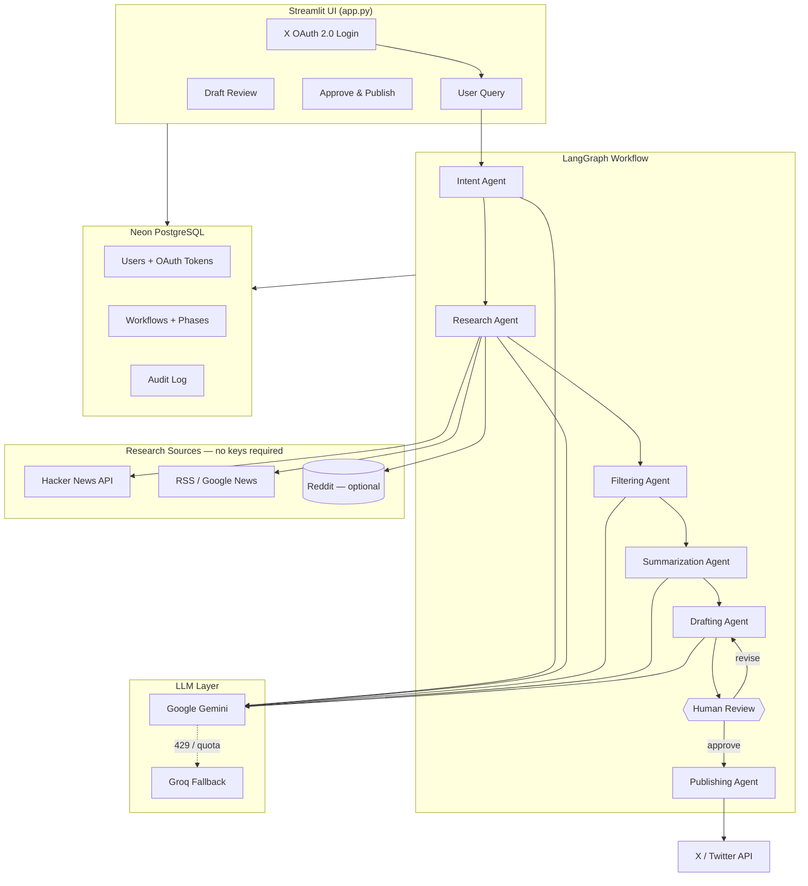

# SignalDraft

**Multi-agent AI pipeline that researches live trends, drafts tweets, and publishes to X — only after human approval.**

[](https://www.python.org/downloads/)
[](https://github.com/langchain-ai/langgraph)
[](https://streamlit.io)
[](LICENSE)

> Connect your X account → enter a topic → agents research Hacker News & RSS → Gemini drafts a tweet → you review → publish to **your** account.

---

## What makes this project different

Most “AI Twitter bots” are single-prompt scripts. **SignalDraft** is a **production-shaped** system:

| Capability | Implementation |
|------------|----------------|
| Multi-agent orchestration | LangGraph state machine with 6 specialized agents |
| Human-in-the-loop safety | Pipeline pauses before publish — nothing posts without approval |
| Multi-user X login | OAuth 2.0 + PKCE per user; tokens encrypted at rest (Fernet) |
| Resilient LLM layer | Google Gemini primary → Groq automatic fallback on rate limits |
| Multi-source research | **Hacker News API + RSS feeds** (no keys); Reddit optional |
| Production database | Neon PostgreSQL + Alembic migrations + audit log |
| Rate limiting | Per-user daily caps on workflows, LLM calls, and publishes |
| Deploy-ready | Streamlit Cloud + `.streamlit` config + secrets template |

---

## Architecture



### Agent pipeline

```
User query
    │
    ▼
┌─────────────┐   topic, scope, tone
│ Intent      │   Understand what to research
└──────┬──────┘
       ▼
┌─────────────┐   Hacker News + RSS (+ Reddit if configured)
│ Research    │   ReAct-style strategy → multi-source fetch
└──────┬──────┘
       ▼
┌─────────────┐   Top-K by relevance & engagement
│ Filter      │
└──────┬──────┘
       ▼
┌─────────────┐   Summary + key trends
│ Summarize   │
└──────┬──────┘
       ▼
┌─────────────┐   ≤280 char tweet draft
│ Draft       │◄── revision loop
└──────┬──────┘
       ▼
┌─────────────┐   PAUSE — Streamlit review UI
│ Human Review│   Approve / Revise / Reject
└──────┬──────┘
       ▼
┌─────────────┐   Post to user's X via OAuth token
│ Publish     │
└─────────────┘
```

---

## Tech stack

| Layer | Technology |
|-------|------------|
| Language | Python 3.12+ |
| UI | Streamlit |
| Agents | LangGraph + LangChain |
| Primary LLM | Google Gemini (`gemini-3.1-flash-lite`) |
| Fallback LLM | Groq (`llama-3.3-70b-versatile`) |
| Database | SQLAlchemy 2.0, Alembic, Neon PostgreSQL |
| Auth | X OAuth 2.0 PKCE, Fernet token encryption |
| Research | Hacker News Firebase API, RSS/Atom (feedparser), PRAW optional |
| Testing | pytest (27 tests) |

---

## Quick start

### 1. Clone & install

```bash
git clone https://github.com/YOUR_USERNAME/social_media_automation.git
cd social_media_automation
python -m venv venv
source venv/Scripts/activate   # Windows Git Bash
pip install -r requirements.txt
```

### 2. Configure environment

```bash
cp .env.example .env
python generate_encryption_key.py   # copy output to ENCRYPTION_KEY
```

**Required for full app:**

| Variable | Purpose |
|----------|---------|
| `GOOGLE_API_KEY` | Primary LLM (Gemini) |
| `GROQ_API_KEY` | Fallback LLM |
| `DATABASE_URL` | Neon PostgreSQL connection string |
| `TWITTER_CLIENT_ID` | X OAuth 2.0 Client ID |
| `TWITTER_CLIENT_SECRET` | X OAuth 2.0 Client Secret |
| `TWITTER_CALLBACK_URL` | `http://localhost:8501` locally |
| `ENCRYPTION_KEY` | Fernet key for token storage |

**Research works without Reddit keys** — Hacker News + RSS need no registration.

### 3. Initialize & verify

```bash
python main.py migrate
python main.py verify
python -m pytest tests/ -v
```

### 4. Run

```bash
python main.py
```

Open **http://localhost:8501** → Connect with X → enter a topic → review draft → publish.

---

## Research sources

| Source | Keys needed | Best for |
|--------|-------------|----------|
| **Hacker News API** | None | Tech, AI, startups |
| **RSS feeds** | None | World news, business, technology |
| Google News RSS | None | Query-specific headlines |
| Reddit (PRAW) | Optional | Subreddit discussions — if you have legacy API access |

> Reddit closed self-service app creation in 2026. SignalDraft defaults to **HN + RSS** so the pipeline works out of the box.

---

## X / Twitter setup

1. [X Developer Portal](https://developer.twitter.com/) → create project & app
2. Enable **OAuth 2.0** → type **Web App**
3. Callback URL: `http://localhost:8501` (local) or `https://your-app.streamlit.app` (deploy)
4. Permissions: **Read and write**
5. Copy **OAuth 2.0 Client ID** and **Client Secret** (not OAuth 1.0 API keys)

```bash
python check_x_oauth.py
python check_twitter_config.py
```

---

## Deploy (Streamlit Cloud — free)

1. Push repo to GitHub
2. [share.streamlit.io](https://share.streamlit.io) → New app → `app.py`
3. Add secrets from `.streamlit/secrets.toml.example`
4. Set `TWITTER_CALLBACK_URL` to your Streamlit URL
5. Update X portal callback to match
6. Run `python main.py migrate` against Neon once

```bash
python main.py verify
```

---

## Project structure

```
social_media_automation/
├── app.py                      # Streamlit UI
├── main.py                     # CLI entrypoint
├── src/
│   ├── agents/                 # Intent, Research, Filter, Summarize, Draft, Publish
│   ├── auth/                   # OAuth 2.0 PKCE, encryption, token refresh
│   ├── config/                 # Pydantic settings
│   ├── database/               # SQLAlchemy models + db_manager
│   ├── services/               # Background job runner
│   ├── utils/                  # HN, RSS, Reddit, Twitter, LLM fallback
│   └── workflow/               # LangGraph graph + state
├── alembic/                    # Database migrations
├── tests/                      # pytest suite
└── .streamlit/                 # Cloud config + secrets template
```

---

## CLI commands

| Command | Description |
|---------|-------------|
| `python main.py` | Launch Streamlit app |
| `python main.py verify` | Validate all services |
| `python main.py migrate` | Run Alembic migrations |
| `python main.py init-db` | Create tables (SQLite dev) |
| `python demo_simulation.py` | Offline pipeline demo |
| `python demo_complete_pipeline.py` | Full CLI with legacy X keys |

---

## Security & compliance

- OAuth tokens encrypted with **Fernet** before database storage
- PKCE verifiers stored server-side during OAuth handshake
- **Audit log** for connect, disconnect, workflow, and publish events
- Input sanitization on user queries and revision feedback
- Per-user rate limits (configurable via `.env`)
- Human approval required before any post goes live
- Research uses official public APIs (HN, RSS); no scraping of paywalled content

---

## CV / portfolio pitch

> Built **SignalDraft**, a production-grade multi-agent system using **LangGraph** that aggregates **Hacker News and RSS** research, generates social drafts with **Gemini/Groq**, and publishes to **X via OAuth 2.0** after human review — deployed on **Streamlit Cloud** with **Neon PostgreSQL**, encrypted tokens, Alembic migrations, and a full audit trail.

---

## License

MIT — see [LICENSE](LICENSE) if present.

---

**Built with LangGraph · Gemini · Groq · Streamlit · Neon**
