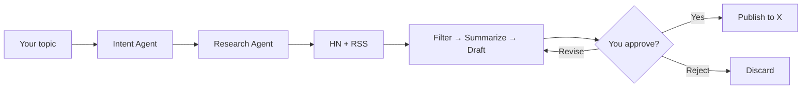

# SignalDraft

**Research live news. Draft with AI. Publish to X — only after you approve.**

[](https://signaldraft.streamlit.app/)
[](https://tinyurl.com/signaldraft)
[](https://www.python.org/downloads/)
[](https://github.com/langchain-ai/langgraph)
[](https://streamlit.io)

---

## Links

| | |
|---|---|
| **Live app** | [signaldraft.streamlit.app](https://signaldraft.streamlit.app/) |
| **Full demo** | [tinyurl.com/signaldraft](https://tinyurl.com/signaldraft) |
| **Source code** | [github.com/Rana-Hassan7272/SocialMedia_Automation_Agent](https://github.com/Rana-Hassan7272/SocialMedia_Automation_Agent) |

> The demo shows the complete flow: topic → multi-source research → AI draft → human approval → automatic post to X.

---

## The problem

Staying relevant on X means constantly reading news, filtering noise, writing sharp posts, and hitting publish — every day. Most teams either:

- Spend hours manually scanning feeds and drafting, or
- Use risky auto-bots that post without review and damage brand trust.

**SignalDraft solves both:** automation where it helps, human control where it matters.

---

## What SignalDraft does

1. **You enter a topic** — e.g. *"What's happening in AI agents today?"*
2. **Agents research** — Hacker News + RSS headlines (no API keys required for research)
3. **AI drafts a tweet** — Google Gemini (Groq fallback) writes a ≤280 character post
4. **You review** — Approve, request a revision, or reject
5. **One click publishes** — Approved drafts go to **your** connected X account

Nothing posts without your explicit approval.

---

## Why this is different

| Typical AI bot | SignalDraft |
|----------------|-------------|
| Single prompt → post | 6-agent LangGraph pipeline |
| No research step | Live HN + RSS research |
| Auto-posts blindly | Human-in-the-loop gate before publish |
| One shared API key | Per-user OAuth + encrypted tokens |
| Breaks on LLM limits | Gemini primary → Groq automatic fallback |
| Demo-quality code | Production DB, migrations, audit log, rate limits |

### Built for real-world use

- **Multi-agent orchestration** — Intent → Research → Filter → Summarize → Draft → Publish
- **Human-in-the-loop safety** — Pipeline pauses until you approve
- **Multi-source research** — Hacker News API + RSS (Reddit optional)
- **Resilient AI** — Gemini primary, Groq fallback on quota/errors
- **Secure auth** — OAuth 2.0 PKCE, Fernet-encrypted tokens, Neon PostgreSQL
- **Rate limiting** — Per-user daily caps on workflows, AI calls, and publishes
- **Audit trail** — Connect, workflow, and publish events logged server-side

---

## Status: live & invite-only

SignalDraft is **fully built and deployed**. The engineering work is done:

- Streamlit UI live at [signaldraft.streamlit.app](https://signaldraft.streamlit.app/)
- Neon PostgreSQL, Alembic migrations, background jobs
- OAuth login, encrypted token storage, publish pipeline
- 27 automated tests passing

**What remains is operational, not development:** X (Twitter) API is **pay-as-you-go**. Free-tier API access does not support full multi-user OAuth posting for the public. Enabling posting for a new user requires X Developer billing to be activated for that account.

**Want access?** Contact me directly — I enable accounts on request.

---

## Watch the demo

The full end-to-end recording is here:

**[https://tinyurl.com/signaldraft](https://tinyurl.com/signaldraft)**

It shows:

- Research agents pulling live signals
- AI generating a draft from real news
- Human approval step in the UI
- Successful publish to X

---

## Architecture



### Agent pipeline

```
User query
    → Intent      (topic, scope, tone)
    → Research    (Hacker News + RSS)
    → Filter      (top signals by relevance)
    → Summarize   (key insights + trends)
    → Draft       (≤280 char tweet)
    → Human review (approve / revise / reject)
    → Publish     (your X account via OAuth)
```

---

## Tech stack

| Layer | Technology |
|-------|------------|
| Language | Python 3.12+ |
| UI | Streamlit |
| Agents | LangGraph + LangChain |
| Primary LLM | Google Gemini |
| Fallback LLM | Groq |
| Database | SQLAlchemy 2.0, Alembic, Neon PostgreSQL |
| Auth | X OAuth 2.0 PKCE, Fernet encryption |
| Research | Hacker News API, RSS/Atom (feedparser) |
| Testing | pytest |

---

## For developers

### Quick start (local)

```bash
git clone https://github.com/Rana-Hassan7272/SocialMedia_Automation_Agent.git
cd SocialMedia_Automation_Agent
python -m venv venv
source venv/Scripts/activate   # Windows Git Bash
pip install -r requirements.txt
cp .env.example .env
python generate_encryption_key.py
python main.py migrate
python main.py verify
python main.py
```

Open **http://localhost:8501**

### Required environment

| Variable | Purpose |
|----------|---------|
| `GOOGLE_API_KEY` | Primary LLM (Gemini) |
| `GROQ_API_KEY` | Fallback LLM |
| `DATABASE_URL` | Neon PostgreSQL |
| `TWITTER_CLIENT_ID` | X OAuth 2.0 Client ID |
| `TWITTER_CLIENT_SECRET` | X OAuth 2.0 Client Secret |
| `TWITTER_CALLBACK_URL` | `http://localhost:8501/` locally |
| `ENCRYPTION_KEY` | Fernet key for token storage |

Research works without Reddit keys — Hacker News + RSS need no registration.

### CLI

| Command | Description |
|---------|-------------|
| `python main.py` | Launch Streamlit app |
| `python main.py verify` | Validate services |
| `python main.py migrate` | Run database migrations |
| `python -m pytest tests/ -v` | Run test suite |

---

## Security

- OAuth tokens encrypted at rest (Fernet)
- Human approval required before any publish
- Input sanitization on queries and feedback
- Per-user rate limits
- Audit log for connect, workflow, and publish events
- Official public APIs only (HN, RSS) — no paywall scraping

---

## Contact & access

SignalDraft is production-ready. To use it with your X account, **contact me** and I will enable API access for you.

- **GitHub:** [Rana-Hassan7272/SocialMedia_Automation_Agent](https://github.com/Rana-Hassan7272/SocialMedia_Automation_Agent)
- **Live app:** [signaldraft.streamlit.app](https://signaldraft.streamlit.app/)
- **Demo:** [tinyurl.com/signaldraft](https://tinyurl.com/signaldraft)

---

**Built with LangGraph · Gemini · Groq · Streamlit · Neon**
